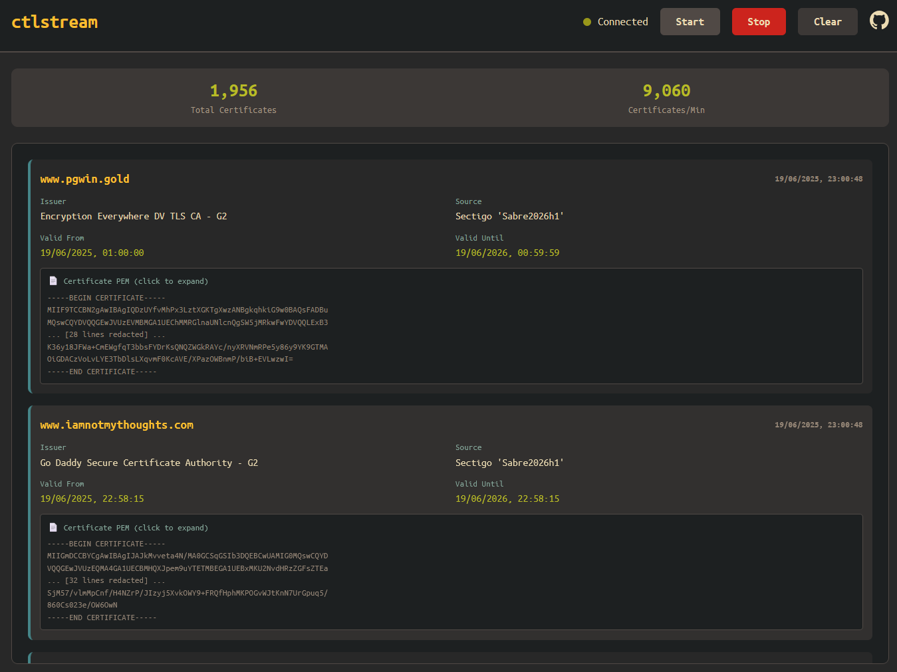

# ctlstream

A simple [Certificate Transparency Log](https://en.wikipedia.org/wiki/Certificate_Transparency) streaming implementation. It fetches all known usable logs from a [list maintained by Google](https://www.gstatic.com/ct/log_list/v3/all_logs_list.json) and monitors those logs for new certificate issuances. The output is streamed via a websocket in JSON format, available to consume using any client of your choice.

# Demo

A demo showing the stream in action can be found at: https://ctlstream-demo.interrupt.sh/



# Installation

Binaries for Linux, OSX and Windows can be found on the [latest release](https://github.com/thoaid/ctlstream/releases/latest) page. 

# Usage

* Certificates are included in the output by default. If you only care about metadata, pass the `-nocert` flag when starting the server.

* A websocket will be exposed via `:8080/ws`. You can connect to it using any client of your choice. For example, using `websocat`:

```
$ websocat ws://localhost:8080/ws
{"subject":{"CN":"jalq.in","O":null,"OU":null,"C":null,"raw":"CN=jalq.in"},"sans":{"dns_names":["jalq.in","www.jalq.in"],"ip_addresses":null},"issuer":{"CN":"Go Daddy Secure Certificate Authority - G2","O":["GoDaddy.com, Inc."],"OU":["http://certs.godaddy.com/repository/"],"C":["US"],"raw":"CN=Go Daddy Secure Certificate Authority - G2,OU=http://certs.godaddy.com/repository/,O=GoDaddy.com\\, Inc.,L=Scottsdale,ST=Arizona,C=US"},"not_before":"2025-06-19T23:39:54Z","not_after":"2025-09-17T23:39:54Z","source":"Google 'Argon2025h2' log","timestamp":1750380090}
{"subject":{"CN":"externalapi-dev-01.horizon-hlx.aws-dev.capgroup.com","O":["The Capital Group Companies Inc"],"OU":null,"C":["US"],"raw":"CN=externalapi-dev-01.horizon-hlx.aws-dev.capgroup.com,O=The Capital Group Companies Inc,L=San Antonio,ST=Texas,C=US"},"sans":{"dns_names":["externalapi-dev-01.horizon-hlx.aws-dev.capgroup.com"],"ip_addresses":null},"issuer":{"CN":"DigiCert Global G2 TLS RSA SHA256 2020 CA1","O":["DigiCert Inc"],"OU":null,"C":["US"],"raw":"CN=DigiCert Global G2 TLS RSA SHA256 2020 CA1,O=DigiCert Inc,C=US"},"not_before":"2025-06-20T00:00:00Z","not_after":"2025-11-02T23:59:59Z","source":"Google 'Argon2025h2' log","timestamp":1750380090}
{"subject":{"CN":"nssol960519a2461d7e19b3devaos.axcloud.dynamics.com","O":["Microsoft Corporation"],"OU":null,"C":["US"],"raw":"CN=nssol960519a2461d7e19b3devaos.axcloud.dynamics.com,O=Microsoft Corporation,L=Redmond,ST=WA,C=US"},"sans":{"dns_names":["nssol960519a2461d7e19b3devret.axcloud.dynamics.com","nssol960519a2461d7e19b3devpos.axcloud.dynamics.com","nssol960519a2461d7e19b3devaossoap.axcloud.dynamics.com","nssol960519a2461d7e19b3devaos.axcloud.dynamics.com"],"ip_addresses":null},"issuer":{"CN":"Microsoft Azure RSA TLS Issuing CA 08","O":["Microsoft Corporation"],"OU":null,"C":["US"],"raw":"CN=Microsoft Azure RSA TLS Issuing CA 08,O=Microsoft Corporation,C=US"},"not_before":"2025-06-20T00:29:46Z","not_after":"2025-12-17T00:29:46Z","source":"Google 'Argon2025h2' log","timestamp":1750380090}
...
```

* The output is simple JSON. You can pipe it into tools like `jq` or save it to a file for post-processing:

```
$ websocat wss://ctlstream.interrupt.sh/stream  | jq -r '.sans.dns_names'
["www.lookbackinstagram.com", "lookbackinstagram.com"]
["*.kiltbenchmark.org", "kiltbenchmark.org", "www.kiltbenchmark.org"]
["*.na1-event-dev.cvent.cloud", "*.connect-2025-ai-switcher-test-0-1-3-pr-15.na1-event-dev.cvent.cloud"]
["*.okempleos.com", "www.admin.okempleos.com", "www.qaadmin.okempleos.com", "www.qaapp.okempleos.com"]
...
...
```

# Public instance

A public instance of ctlstream can be found at: `wss://ctlstream.interrupt.sh/stream`